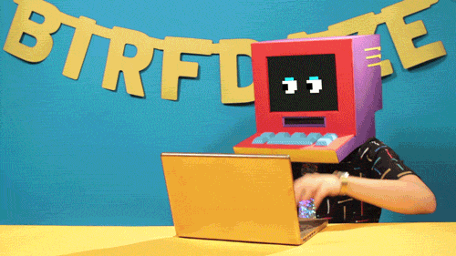
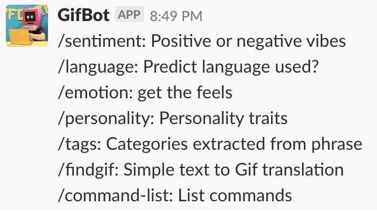

# GifBot

<p align="center"></p>
<p align="center"><i>GifBot is a Slack bot that converts sentences into GIFs based on textual queues through sentiment analysis.</i></p>
<br>

## Libraries, Tools and APIs
   
<li><b><a href="https://stdlib.com/">Stdlib</a></b>: Where our API is hosted</li>
<li><b><a href="https://indico.io/">Indico</a></b>: Provides text analysis</li>
<li><b><a href="https://slack.com/">Slack</a></b>: Website where bot runs</li>
<li><b><a href="https://nodejs.org/en/">NodeJS</a></b>: Langauge bot is written in</li>
<li><b><a href="https://giphy.com/">Giphy</a></b>: Where GIFs are sourced from</li>
<br>

## How it works

<p>GifBot offers a series of commands depending on the operations you would like to perform. The list of commands are available below.</p>


<p>Performing an operation is as simple as entering: /command: text input</p>

## Examples

### Sentiment
<p>The sentiment command takes your input text and returns either positve or negative based on the predicted sentiment of your sentence. It also returns an appropriate gif based on the output.</p>
</p>Output of entering:</p>
```
/sentiment I love coding 
```

<a href="https://gyazo.com/8b18bf8a55d6591d7a5f07c802f76680"></a>


### emotion
<p>The emotion command takes your input text and returns an emotion after analyzing your sentence. It also returns an appropriate gif based on the output.</p>
<p> Output of entering </p>
``` /emotion I feel great ```

<a href="https://gyazo.com/78b0b7b4636b1455611dcaa1becda573"></a>

### language
